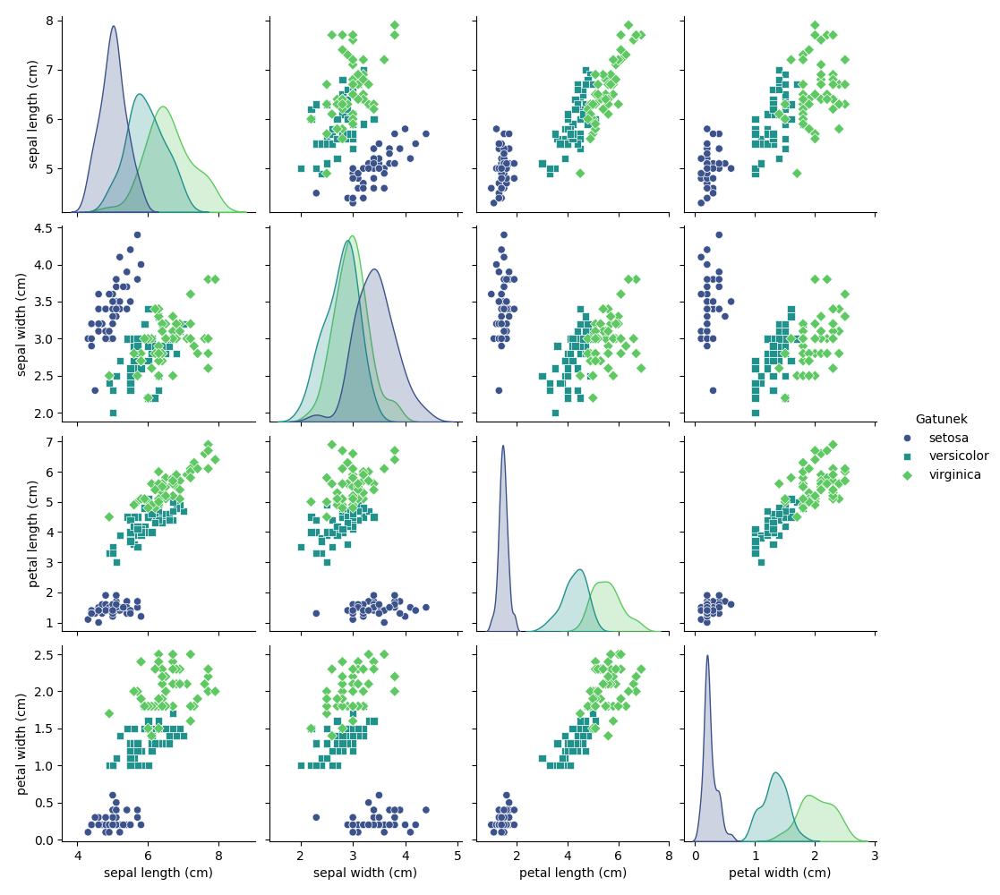
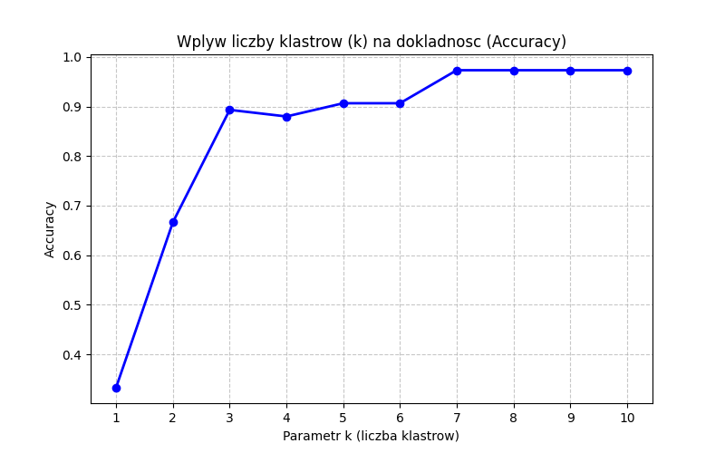
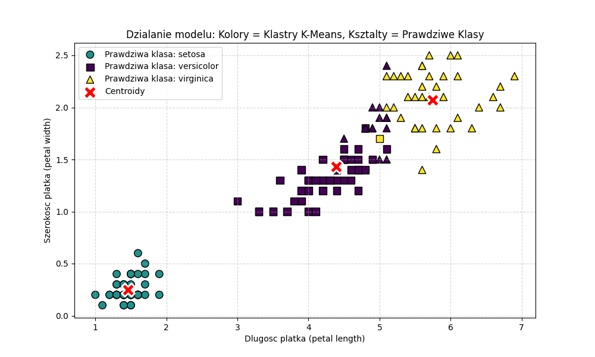
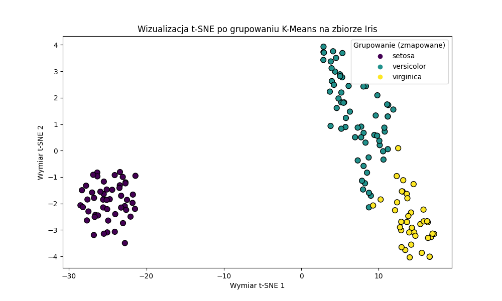

# Sprawozdanie - Zbiór Iris

**Imię i Nazwisko:** Krystian Osak  
**Numer indeksu:** 94803  
**Grupa:** 2 (Grupowanie przy użyciu algorytmu K-Means)  

## 1. Szersza analiza danych (EDA)
Zbiór danych Iris składa się z 150 próbek kwiatów, podzielonych po równo (po 50 sztuk) na 3 gatunki: Setosa, Versicolor oraz Virginica. Każda próbka opisana jest za pomocą 4 cech liczbowych.

Aby dokładniej przeanalizować rozkład cech, wygenerowano wykres typu *pairplot*, zestawiający ze sobą każdą parę atrybutów:

**Wnioski z analizy:** Z wykresów jasno wynika, że gatunek Setosa jest niemal idealnie liniowo separowalny od pozostałych klas, szczególnie biorąc pod uwagę cechy płatków (petal length oraz petal width). Gatunki Versicolor i Virginica są do siebie znacznie bardziej zbliżone i ich cechy częściowo na siebie nachodzą, co stanowi główne wyzwanie dla algorytmu grupującego.

## 2. Wpływ parametru k na jakość modelu
Aby sprawdzić, jak liczba klastrów ($k$) wpływa na skuteczność przypisywania, przeprowadzono iterację dla $k$ w przedziale od 1 do 10. Dokonano rzutowania (mapowania) klastrów na najczęściej występującą w nich prawdziwą etykietę i obliczono dokładność (Accuracy).

**Wnioski:** Wykres pokazuje gwałtowny wzrost dokładności, gdy przechodzimy z parametru 2 na 3. Wynika to wprost z charakterystyki zbioru, który posiada dokładnie 3 naturalne gatunki. Zwiększanie wartości $k$ powyżej 3 powoduje sztuczne dzielenie tych samych gatunków na mniejsze sub-klastry (co dla algorytmu nienadzorowanego prowadzi do zjawiska przeuczenia i rozbijania spójnych grup). Optymalnym wyborem dla tego zbioru pozostaje 3.

## 3. Szczegółowe działanie modelu K-Means
Poniższa grafika obrazuje sposób działania algorytmu K-Means na bazie dwóch najbardziej informatywnych cech: długości i szerokości płatka. 
* **Kolor punktu** oznacza przypisanie do danego klastra przez algorytm.
* **Kształt punktu** to faktyczna (prawdziwa) klasa kwiatu.
* **Czerwone znaki X** oznaczają środki ciężkości (centroidy) wyznaczone przez model.

Grafika doskonale obrazuje, w których miejscach model myli się w stosunku do prawdziwych etykiet. O ile klaster reprezentujący Setosę został zidentyfikowany bezbłędnie, o tyle na pograniczu klastrów Versicolor i Virginica widać kształty z jednym kolorem przemieszane z innym, co obniża końcowe metryki. Centroidy prawidłowo ustawiły się w gęstych skupiskach punktów.

## 4. Wyniki grupowania i metryki końcowe
Dla optymalnego parametru wynoszącego 3, po zmapowaniu klastrów, uzyskano następujące metryki:

* **Accuracy (Dokładność):** 0.8933
* **Precision (Precyzja - średnia ważona):** 0.9072
* **Recall (Czułość - średnia ważona):** 0.8933
* **F1-Score:** 0.8918

Ukazuje nam się tutaj świetny wynik na poziomie około 89%, biorąc pod uwagę, że algorytm nie miał z góry podanych etykiet w procesie uczenia.

## 5. Wizualizacja t-SNE
Aby przedstawić 4-wymiarowe dane na wykresie 2D, wykorzystałem algorytm redukcji wymiarowości t-SNE. Poniższy wykres prezentuje ostateczny podział na klastry dokonany przez model K-Means.

